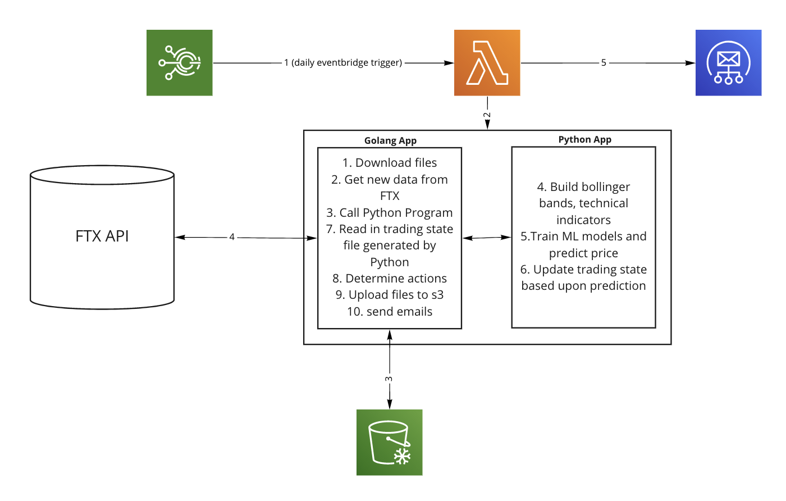

# Go Trader

- Golang lambda app that trigger buy signals alongside a Python ML model

Above, we can see a sample run on historic Bitcoin prices.

- [Go Trader](#go-trader)
  - [Data](#data)
    - [Adding a new col of data](#adding-a-new-col-of-data)
  - [Architecture](#architecture)
  - [Data](#data-1)
  - [Models](#models)
  - [Deployment](#deployment)
    - [Infrastructure](#infrastructure)
    - [CI/CD](#cicd)
    - [Deploy](#deploy)
      - [Adding a new coin](#adding-a-new-coin)
  - [Testing](#testing)
  - [Performance](#performance)

## Data

1. `wget http://api.bitcoincharts.com/v1/csv/localbtcUSD.csv.gz`
- This data is used in `notebooks/testing_bollinger_bands_and_ts_models.ipynb`
2. Manually scrape data from [https://coinmarketcap.com/](https://coinmarketcap.com/)
- This data is more recent, up to 09-04-2021, and is used in `notebooks/bollinger_bands_and_coinbase_data.ipynb`
3. Download SPY data from [here](https://www.nasdaq.com/market-activity/funds-and-etfs/spy/historical)
4. [Coin market cap ](https://coinmarketcap.com/)

### Adding a new col of data

1. Add into the `BollingerBandsPredictor`
2. Update the `self.ml_train_cols` to include this col

## Architecture

1. The go app handles connecting to the FTX exchange, pulling down data from/pushing up data to  S3, adding the new data, launching the python program, and executing orders
2. The Python program trains the ML models, builds the Bollinger Bands, predict whether to enter/exit trades and returns current trade information to the golang app.

## Data

- All data is store in S3 in `s3://go-trader/data`

## Models

- Stored in S3 in `s3://go-trader/models`

## Deployment

### Infrastructure

- All contained in the `terraform/` directory. This project uses   `tfswitch` to change between Terraform versions.
1. `bash terraform plan`
2. `bash terraform apply`
Helpful Terraform article for VPC lambdas [here](https://www.maxivanov.io/deploy-aws-lambda-to-vpc-with-terraform/)

S3 bucket: `go-trader`

### CI/CD

Via Github Actions
- Use act to test locally
- `bash brew install act`
- run act `bash act`

### Deploy

1. Make any config changes and then `make upload_configs`
2. Build and push the docker image `./build.sh`
3. If you need to update any env vars, use the `scripts/set_ssm.sh` script with the name and value. This includes new FTX env vars for different accounts.
4. Update the Docker Image for the lambda if you've build a new one
- `aws lambda update-function-code --function-name go-trader-function --image-uri $(aws lambda get-function --function-name go-trader-function | jq -r '.Code.ImageUri')`
5. Wait for the next Lambda run!

#### Adding a new coin

1. Add new data to the [google sheet here](https://docs.google.com/spreadsheets/d/1fBvirRK7m17jYj0t1yO6Jagq_aFjQvJ5EApnHOZQz20/edit#gid=114347281). I like using (Coin Market Cap)[https://coinmarketcap.com/] for historical data.
2. Download this data and put it into the `data/` directory and the `tmp/` directory. The data directory is used for local analysis / simulations. The tmp directory is used for the AWS lambda
3. Run simulations in the testing jupyter notebook to see how the default config would work. For new coins, we should use `eth` and `btc` as the additional_dfs argument.
4. Setup a new FTX account, generate an api key for this account, create aws SSM params for these params, in the `ssm_store.go`, set these values as env vars. Also add these to the env_vars.sh file
5. Add these env vars using `scripts/set_ssm.sh`. `./scripts/set_ssm.sh FTX_KEY <your-api-key>`
6. Update the `main.go` file to create a new FTX client for this coin
7. Update the `main.py` files for this new coin as well as `predict_price_movements.py` . Grep around for `btc` to see what code to update
8. Download the current configs `make download_configs` . We're going to be re-uploading the state and want the latest snapshot of reality
9. Create new `*.yml` files under `tmp/` (here). This includes the three coin specific files (actions_to_take, trading_state_config, won_and_lost), and updating the `constants.yml` file.
10. Create a new Eventbridge trigger in the `main.tf` file
11. Upload the configs `make upload_configs`
12. Upload the dataset `make upload_data`
13.  build the lambda image `./build.sh`
14. update the lambda with the new image!
`aws lambda update-function-code --function-name go-trader-function --image-uri $(aws lambda get-function --function-name go-trader-function | jq -r '.Code.ImageUri')`
NB: be sure to update the various checks that look for the correct input coins

## Testing

1. New Python code
- `make run_python`
2. New Golang code (need to build the go binary and run it as if it were a lambda)
- `docker run --rm -v "$PWD":/go/src/handler lambci/lambda:build-go1.x sh -c 'go build app/src/main.go'`
- `docker run --rm -e  ON_LOCAL=true -v "$HOME"/.aws:/home/sbx_user1051/.aws:ro -v "$PWD":/var/task lambci/lambda:go1.x  main '{"coinToPredict": "btc"}'`
    - Can change the `coinToPredict` to any of the currently supported coins
- To test the full app, you need to build the docker image, update the lambda, and test the lambda

## Performance

- View the different model performance results [here](https://docs.google.com/spreadsheets/d/1xEaxfYBcXNcGN71LAj_Yw-EDEifm_MficTvFqpLUR3s/edit?usp=sharing)
